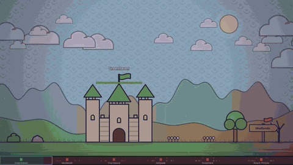

# Magic Pencil: Kingdoms of Paper

> **Whatever you draw comes alive.** Unlimited ink. Unlimited enemies. The limit is your imagination – against everyone else's.

A free, open-source browser game inspired by the *Oggy and the Cockroaches* episode **"The Magic Pen"**.
Draw anything, give it a name, and it comes to life and does what its name says.

[](media/ad.mp4)

**▶ Play now:** https://devkancheti4-design.github.io/magic-pencil-kingdoms/ (no install, works on desktop and touch)

## How it works

| you write… | it… |
| --- | --- |
| `archer`, `arrowman`, `sniper` | shoots from a distance |
| `knight`, `soldier`, `wolf`, `monster` | walks up and hits things |
| `horse`, `camel`, `bike` | runs fast and carries a rider drawn on top of it |
| `dragon`, `bird`, `plane` | flies |
| `wall`, `tower`, `cake`, `bomb`, `doctor`, `trap` | blocks · shoots · lures · explodes · heals · traps |
| `4 arm archer` | fires 4 arrows at once |
| `floating blades` | floats **and** spins, hitting everything it touches |
| `giant strong green monster` | is giant, strong and green |
| `fire`, `ice`, `poison`, `lightning`, `fast`, `tiny`, `army`, `guard`, `follow` | …you get the idea |

The **shape** matters too: bigger = tougher, more legs = faster, spikes = more damage, a closed or coloured-in body = armour, more detail = masterpiece bonus. The in-game **Spellbook** lists every word.

## The world

Six kingdoms on one long sheet of paper. Yours is Greenhaven. The roaches drew the other five – with pink rifle soldiers, tanks, arrow-planes and a scribbled dragon guarding each castle. Drawings only come alive on your own land; smash a castle to capture its kingdom and build there. Enemy kingdoms raid you while you play.

## The Studio

Press **✎ Studio** and the world pauses. Pen for outlines, bucket or crayon to colour in, mirror mode, undo/redo, size slider, live stat preview. Save designs to your library and stamp them into the world as often as you like. Export/import your library as JSON.

## Face the unknown – community challengers

`community/designs.json` holds creatures made by other players. The game loads it at start and sends them against you in raids and castle garrisons, with their names, wishes and colours intact.
**Add yours:** see [CONTRIBUTING.md](CONTRIBUTING.md) – design it in the Studio, export, paste, open a PR.

## Run locally

```bash
git clone https://github.com/devkancheti4-design/magic-pencil-kingdoms.git
cd magic-pencil-kingdoms
python3 -m http.server 8765   # then open http://localhost:8765
```

Plain HTML/CSS/JavaScript, no build step, no dependencies.

## Controls

Left drag draws · right drag / wheel / arrow keys / minimap pan · Enter brings a sketch alive · Esc erases · click a creature to inspect it and give orders · `S` Studio · `P` pause · `H` Spellbook · `1` home · `2` front line.

## License

MIT – see [LICENSE](LICENSE). Made with a magic pencil and [Claude Code](https://claude.com/claude-code).
